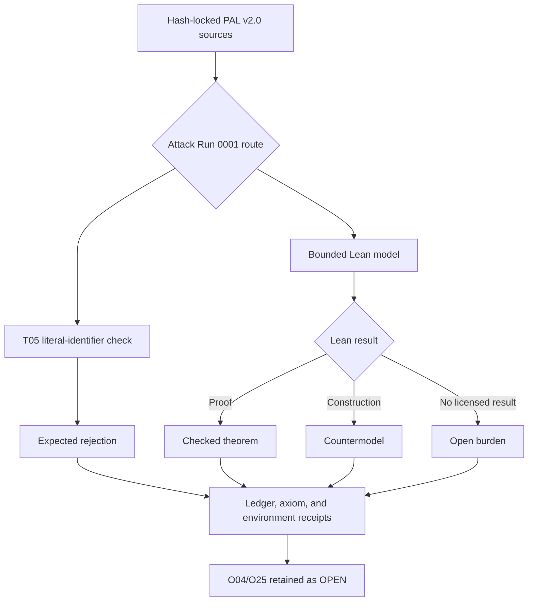

# PAL Lean Audit

A source-locked Lean 4 audit bench for bounded mechanical claims and mathematical realizations of **PAL v2.0**.

> Lean can verify that a formal statement follows from declared definitions and assumptions, construct countermodels to stronger statements, and expose axiom dependencies. It cannot establish PAL as a complete ontology or prove that a formalization exhausts the source framework.

## Current state

This repository contains **Attack Run 0001**, a bounded audit for T05-T07, T09-T11, and T14-T17. The reported proofs, countermodels, and expected rejections apply only to their exact statements and receipts; they do not establish PAL as an ontology or close unresolved possibility.


See [the generated status receipt](docs/generated/summary.md), [the detailed run receipt](Audit/attack-run-0001-receipt.json), and [reporting rules](docs/REPORTING.md).

## Authority boundary

- **Author and steward:** Christopher D. Pang
- **Controlling PAL release:** PAL v2.0, DOI [10.5281/zenodo.21754097](https://doi.org/10.5281/zenodo.21754097)
- **Formal role:** bounded realization and adversarial audit
- **Nonclaim:** this repository does not give mathematics, software, or AI authority to redefine PAL
- **Omega boundary:** unresolved possibility remains metalinguistic; source review forbids a Lean constructor from consuming or identifying it. The automated T05 check is narrower: it rejects only the literal standalone identifiers `Omega` and `Ω` in scanned Lean code and cannot detect differently named semantic surrogates.

The five coordinated PAL v2.0 authority surfaces are recorded in [`Audit/source-manifest.yaml`](Audit/source-manifest.yaml). Scientific branches and integration specifications may supply bounded cases; they do not redefine the spine.

## Result vocabulary

- **PROVED** — Lean checked the exact stated theorem under recorded dependencies.
- **COUNTERMODEL** — Lean checked a construction refuting a stronger statement or showing a rule is necessary.
- **EXPECTED_REJECTION** — an intentionally invalid fixture was rejected for the recorded reason.
- **OPEN** — the current model does not close the burden.
- **NOT_FORMALIZED** — no adequate formal statement has yet been adopted.

A failed proof attempt is not automatically a counterexample. A successful proof has no authority beyond its exact statement, dependencies, and declared scope.

## Audit route



## Reproducible environment

- Lean: `leanprover/lean4:v4.32.1`
- Mathlib: `v4.32.1`
- CI: `leanprover/lean-action@v1.5.0`
- blocking independent check: the Lean toolchain's bundled `leanchecker`
- experimental cross-check: `nanoda`; compatibility failures are retained in the run receipts and do not count as PAL results
- placeholders: `sorry`, `admit`, and unlisted `axiom` declarations are rejected
- pull-request receipts: `pr_head_sha` records the proposed source commit while `tested_merge_sha` records the synthetic merge commit actually checked

Run locally:

```bash
lake update
lake build
python3 scripts/check_policy.py
python3 scripts/render_report.py --check
```

## Attack Run 0001

The run covers the primitive floor and early trace route: T05-T07, T09-T11, and T14-T17. It retains the source rule that unresolved possibility stays outside Lean's object language, lexically rejects the literal standalone identifiers `Omega` and `Ω`, uses supplied-witness dependent receipts for the A0-to-A2 route, checks predecessor and witness-source countercases, preserves protected trace through a bounded route, and prevents modeled later results from rewriting earlier authority.

O04/O25 remains one explicitly open first-occurrence debt. Local witness values construct conditional instances only; they do not settle that debt.

## Licensing

Lean code, scripts, and CI configuration are licensed under Apache-2.0. Documentation, diagrams, and generated explanatory reports are licensed under CC BY 4.0. See [`LICENSE`](LICENSE), [`LICENSE-DOCS.md`](LICENSE-DOCS.md), and [`NOTICE`](NOTICE).

## AI assistance

OpenAI ChatGPT/Codex may assist with transcription, formalization proposals, Lean implementation, tests, reports, charts, and repository maintenance. Christopher D. Pang supplies the framework, source corpus, corrections, and controlling adoption decisions and remains the sole author and authority for PAL.
