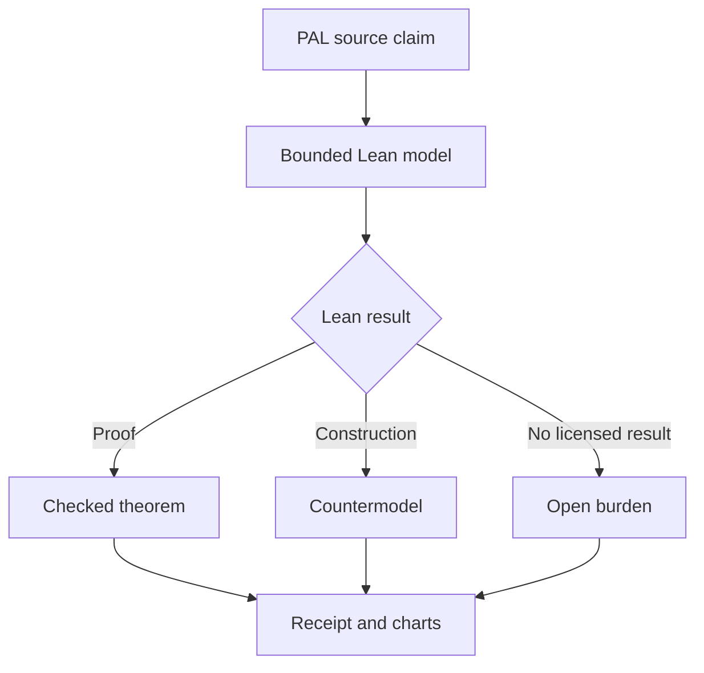

# PAL Lean Audit

A source-locked Lean 4 audit bench for the mechanical claims and bounded mathematical realizations of **PAL v2.0**.

> Lean can verify that a formal statement follows from declared definitions and assumptions, construct countermodels to over-strong statements, and expose axiom dependencies. It cannot establish PAL as a complete ontology or prove that a formalization exhausts the source framework.

## Authority boundary

- **Author and steward:** Christopher D. Pang
- **Controlling PAL release:** PAL v2.0, DOI [10.5281/zenodo.21754097](https://doi.org/10.5281/zenodo.21754097)
- **Formal role:** bounded realization and adversarial audit
- **Nonclaim:** this repository does not give mathematics, software, or AI authority to redefine PAL
- **Omega firewall:** unresolved possibility remains metalinguistic; no Lean constructor may consume or identify it

## Result vocabulary

- **PROVED** - Lean checked the stated theorem under recorded assumptions.
- **COUNTERMODEL** - Lean checked a construction showing that a stronger statement fails or that a rule is necessary.
- **EXPECTED_REJECTION** - an intentionally invalid fixture was rejected for the recorded reason.
- **OPEN** - the current model does not close the burden.
- **NOT_FORMALIZED** - no adequate formal statement has yet been adopted.

A failed proof attempt is not automatically a counterexample. A successful proof is not authority beyond its exact statement and dependencies.

## Audit route

## Planned report surfaces

- outcome-count bar chart
- PAL conformance coverage by T-number
- axiom-dependency count and `sorryAx` detection
- module build-time chart, labeled as runner-dependent
- source-card to definition to theorem dependency diagram
- countermodel and ablation ledger
- exact Lean, Mathlib, runner, operating-system, and commit identity

## Initial target

Attack Run 0001 will cover the primitive floor and early trace route: T05-T07, T09-T11, and T14-T17.

Scientific branches such as BLA, boundary-readable trace, absorber-informed closure, and CLEF may later supply bounded realization cases. They do not redefine the spine.

## AI assistance

OpenAI ChatGPT/Codex may assist with transcription, formalization proposals, Lean implementation, tests, reports, charts, and repository maintenance. Christopher D. Pang supplies the framework, source corpus, corrections, and controlling adoption decisions and remains the sole author and authority for PAL.
