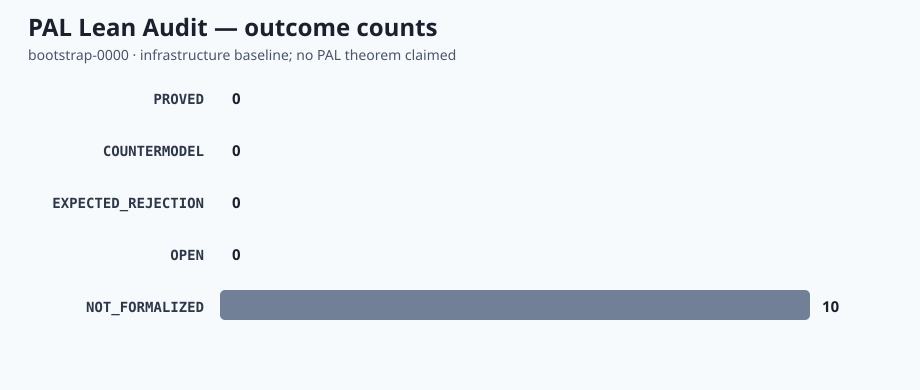
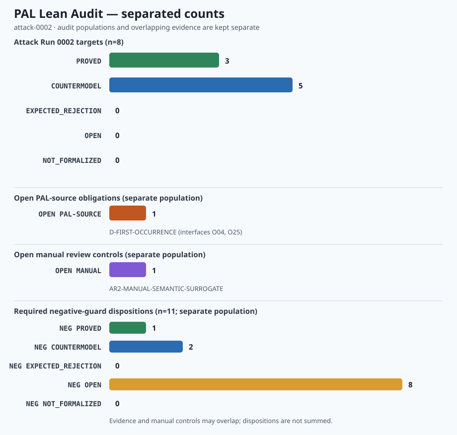
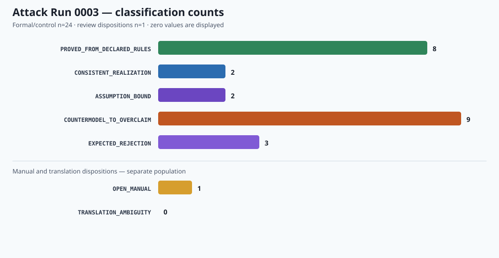
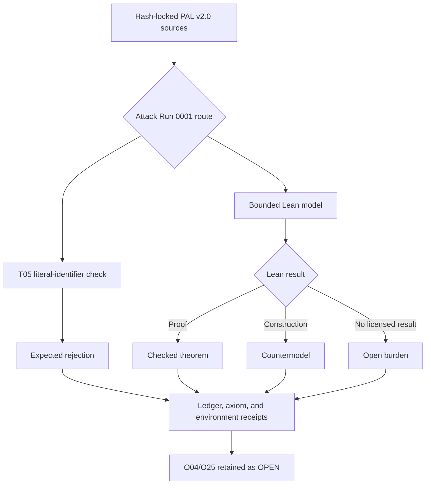

# PAL Lean Audit

A source-locked Lean 4 audit bench for bounded mechanical claims and declared mathematical realizations of PAL. Attack Runs 0001 and 0002 retain their original **PAL v2.0** scope; **PAL v2.1** controls every new run.

> Lean can verify that a formal statement follows from declared definitions and assumptions, construct countermodels to stronger statements, and expose axiom dependencies. It cannot establish PAL as a complete ontology or prove that a formalization exhausts the source framework.

## Current state

This repository contains **Attack Run 0001**, a bounded audit for T05-T07,
T09-T11, and T14-T17, plus **Attack Run 0002**, a noncanonical audit of the
PAL v2.1 first-cut receipt candidates. A checked Attack Run 0002 result does not
adopt C21-01 through C21-08, amend PAL v2.0, or close O04/O25.

**Attack Run 0003** is the first PAL v2.1-led audit of declared Lean
realizations. Its branch-local build, source verification, `leanchecker`,
dependency inspection, policy checks, and historical-integrity regressions pass;
the draft pull request and GitHub Actions receipts remain the publication gate.



See [the generated status receipt](docs/generated/summary.md), [the detailed run receipt](Audit/attack-run-0001-receipt.json), and [reporting rules](docs/REPORTING.md).



See [the candidate proposal](docs/proposals/PAL-v2.1-first-cut-receipt.md),
[impact map](Audit/pal-2.1-impact.yaml),
[generated candidate status receipt](docs/generated/attack-run-0002-summary.md),
and [detailed candidate run receipt](Audit/attack-run-0002-receipt.json).

See the [PAL v2.1 migration summary](docs/generated/pal-v2.0-to-v2.1-migration-summary.md)
and its [append-only receipt](Audit/migrations/pal-v2.0-to-v2.1-migration-receipt.json).



See the [Attack Run 0003 report](docs/generated/attack-run-0003-summary.md),
[machine receipt](Audit/attack-run-0003-receipt.json),
[claim ledger](Audit/attack-run-0003-claim-ledger.json),
[dependency diagram](docs/generated/attack-run-0003-dependencies.svg), and
[benchmark receipt](docs/generated/attack-run-0003-benchmarks.md).

## Authority boundary

- **Author and steward:** Christopher D. Pang
- **Controlling PAL release for new runs:** PAL v2.1, DOI [10.5281/zenodo.21864767](https://doi.org/10.5281/zenodo.21864767)
- **Historical run scope:** Attack Runs 0001 and 0002 remain controlled by PAL v2.0, DOI [10.5281/zenodo.21754097](https://doi.org/10.5281/zenodo.21754097); their original result vocabulary and Attack Run 0002 candidate status are not retroactively changed
- **Formal role:** bounded realization and adversarial audit
- **Nonclaim:** this repository does not give mathematics, software, or AI authority to redefine PAL
- **Omega boundary:** unresolved possibility remains metalinguistic; source review forbids a Lean constructor from consuming or identifying it. The automated T05 check is narrower: it rejects only the literal standalone identifiers `Omega` and `Ω` in scanned Lean code and cannot detect differently named semantic surrogates.

The five coordinated PAL v2.0 authority surfaces used by the historical runs are recorded in [`Audit/source-manifest.yaml`](Audit/source-manifest.yaml). The published PAL v2.1 lock for new runs is [`Audit/releases/pal-v2.1-source-manifest.json`](Audit/releases/pal-v2.1-source-manifest.json). Scientific branches, formal audits, and integration specifications may supply bounded evidence; they do not redefine the spine or exercise adoption authority.

## Result vocabulary

- **PROVED** — Lean checked the exact stated theorem under recorded dependencies.
- **COUNTERMODEL** — Lean checked a construction refuting a stronger statement or showing a rule is necessary.
- **EXPECTED_REJECTION** — an intentionally invalid fixture was rejected for the recorded reason.
- **OPEN** — the current model does not close the burden.
- **NOT_FORMALIZED** — no adequate formal statement has yet been adopted.

A failed proof attempt is not automatically a counterexample. A successful proof has no authority beyond its exact statement, dependencies, and declared scope.

The five labels above remain the historical Attack Run 0001/0002 result
vocabulary. Attack Run 0003 must not retrofit its classifications onto those
receipts.

## Audit route



## Reproducible environment

- Lean: `leanprover/lean4:v4.32.1`
- Mathlib: `v4.32.1`
- CI: `leanprover/lean-action@v1.5.0`
- blocking independent check: the Lean toolchain's bundled `leanchecker`
- experimental cross-check: `nanoda`; compatibility failures are retained in the run receipts and do not count as PAL results
- placeholders: `sorry`, `admit`, and unlisted `axiom` declarations are rejected
- pull-request receipts: `pr_head_sha` records the proposed source commit while `tested_merge_sha` records the synthetic merge commit actually checked

Run locally:

```bash
lake update
lake build
mkdir -p artifacts
set -o pipefail
lake env lean Audit/AttackRun0003.lean 2>&1 | tee artifacts/attack-run-0003-axioms.txt
python3 scripts/check_attack_run_0003_axioms.py \
  --artifact artifacts/attack-run-0003-axioms.txt
lake env leanchecker PALLeanAudit
python3 scripts/check_policy.py
python3 scripts/check_candidate_inputs.py
python3 scripts/check_attack_run_0003_policy.py
python3 scripts/check_attack_run_0003.py
python3 scripts/check_release_migration.py --published-zip /path/to/PAL_v2.1_Zenodo_Release.zip
python3 scripts/render_report.py --check
python3 scripts/render_report.py \
  --ledger Audit/attack-run-0002-claim-ledger.json \
  --summary docs/generated/attack-run-0002-summary.md \
  --chart docs/generated/attack-run-0002-outcomes.svg \
  --check
python3 scripts/render_migration_report.py --check
python3 scripts/render_attack_run_0003.py --check
```

To regenerate the measured local evidence bundle after a material source or
receipt change, render the migration report, run the benchmark collector, and
then render Attack Run 0003 from the newly measured receipt:

```bash
python3 scripts/render_migration_report.py
python3 scripts/collect_attack_run_0003_benchmarks.py \
  --published-zip /path/to/PAL_v2.1_Zenodo_Release.zip
python3 scripts/render_attack_run_0003.py
```

## Attack Run 0001

The run covers the primitive floor and early trace route: T05-T07, T09-T11, and T14-T17. It retains the source rule that unresolved possibility stays outside Lean's object language, lexically rejects the literal standalone identifiers `Omega` and `Ω`, uses supplied-witness dependent receipts for the A0-to-A2 route, checks predecessor and witness-source countercases, preserves protected trace through a bounded route, and prevents modeled later results from rewriting earlier authority.

O04/O25 remains one explicitly open first-occurrence debt. Local witness values construct conditional instances only; they do not settle that debt.

## Attack Run 0002 — CANDIDATE audit

Attack Run 0002 tests the provisional first-cut receipt ideas recorded in
[planning issue #4](https://github.com/Grativy6/PAL-Lean-Audit/issues/4). It
uses elementary source-fiber, historical-occurrence, local-first, one-step
witnessed-inquiry, and immutable-prior-receipt models. It deliberately omits an
information-theoretic layer, coinduction, coalgebras, and infinite causal
objects because the smaller countermodels suffice.

The run distinguishes first-in-declared-account order from temporal, ontic, or
global primacy; keeps canonical receipt fields distinct instead of redefining
them all as cost; requires supplied witnesses for modeled inquiry events; and
requires a later witnessed trace before reporting recoverable occurrence. O04
and O25 remain two interfaces to one `OPEN` `D-FIRST-OCCURRENCE` obligation.
The semantic-surrogate guard remains a separate `OPEN` manual-review control;
the lexical T05 check cannot discharge it.

## Attack Run 0003 - PAL v2.1 realization audit

Attack Run 0003 is a PAL-led audit of the Lean realizations declared by PAL
v2.1. It is not Lean proving PAL, a canon amendment, a human adoption decision,
an authority grant, or closure of any PAL obligation. Formal evidence is not
adoption authority.

The eight clarification routes are `D16` through `D23`, paired respectively
with `SC-19.1` through `SC-19.8` and `T33` through `T40`. Omega remains
metalinguistic unresolved possibility. O04 and O25 remain separate `OPEN`
interfaces to the single `D-FIRST-OCCURRENCE` debt. The phrase
`occurrence-closed, source-open` is explanatory shorthand only, not a primitive,
layer, or PAL claim status.

Attack Run 0003 uses exactly seven classifications:

- **`PROVED_FROM_DECLARED_RULES`** - the exact theorem follows from the recorded definitions, rules, and dependencies.
- **`CONSISTENT_REALIZATION`** - the declared bounded realization is instantiated in the audited environment; this is not a proof of PAL or of meta-consistency.
- **`ASSUMPTION_BOUND`** - the result materially depends on disclosed assumptions that limit transfer beyond the model.
- **`COUNTERMODEL_TO_OVERCLAIM`** - a checked construction defeats a stronger, unlicensed claim without refuting the controlling PAL statement.
- **`EXPECTED_REJECTION`** - an intentionally invalid fixture is rejected for the recorded reason.
- **`OPEN_MANUAL`** - the issue remains open for human source or semantic review and is not a Lean result.
- **`TRANSLATION_AMBIGUITY`** - more than one materially different formal translation remains live and no unique encoding is claimed.

Machine and fixture classifications, manual and translation dispositions, PAL-source
obligations, and benchmark measurements are separate populations. Their counts
must remain separate and must not be summed into one success total. Each target
must disclose its assumptions. Benchmarks must report actual measurements,
commands, and environment identity; missing measurements remain missing, and
invented numerical correctness scores are prohibited.

Source, adoption, migration, run, and generated-report files:

- [PAL v2.1 source manifest](Audit/releases/pal-v2.1-source-manifest.json)
- [PAL v2.1 adoption receipt](Audit/releases/pal-v2.1-adoption-receipt.json)
- [PAL v2.0-to-v2.1 migration receipt](Audit/migrations/pal-v2.0-to-v2.1-migration-receipt.json)
- [Attack Run 0003 receipt](Audit/attack-run-0003-receipt.json)
- [Attack Run 0003 claim ledger](Audit/attack-run-0003-claim-ledger.json)
- [Attack Run 0003 summary](docs/generated/attack-run-0003-summary.md)
- [Attack Run 0003 classifications chart](docs/generated/attack-run-0003-classifications.svg)
- [Attack Run 0003 dependency chart](docs/generated/attack-run-0003-dependencies.svg)
- [Attack Run 0003 benchmarks](docs/generated/attack-run-0003-benchmarks.md)

## Licensing

Lean code, scripts, and CI configuration are licensed under Apache-2.0. Documentation, diagrams, and generated explanatory reports are licensed under CC BY 4.0. See [`LICENSE`](LICENSE), [`LICENSE-DOCS.md`](LICENSE-DOCS.md), and [`NOTICE`](NOTICE).

## AI assistance

OpenAI ChatGPT/Codex may assist with transcription, formalization proposals, Lean implementation, tests, reports, charts, and repository maintenance. Christopher D. Pang supplies the framework, source corpus, corrections, and controlling adoption decisions and remains the sole author and authority for PAL.
