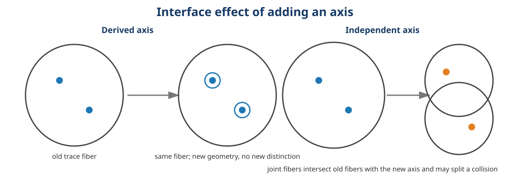
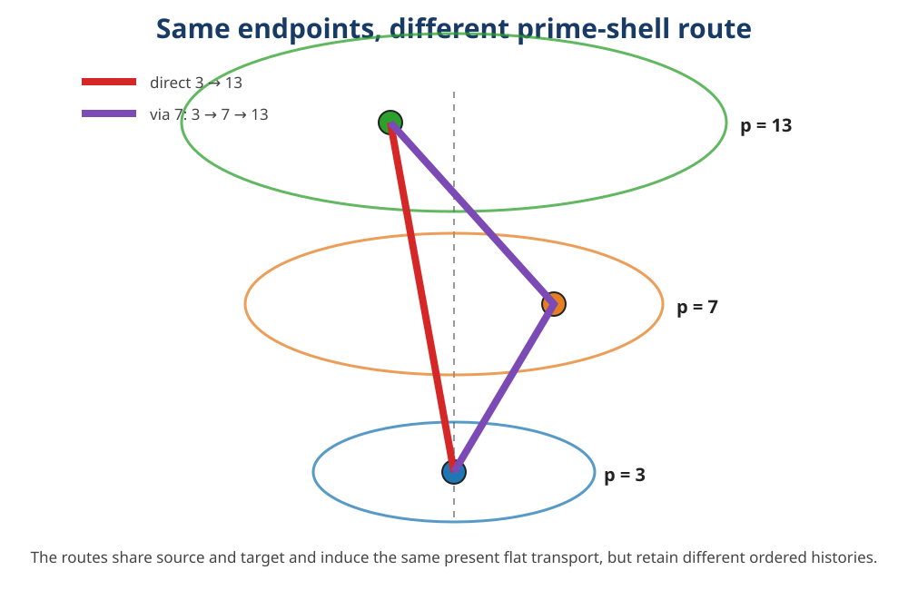
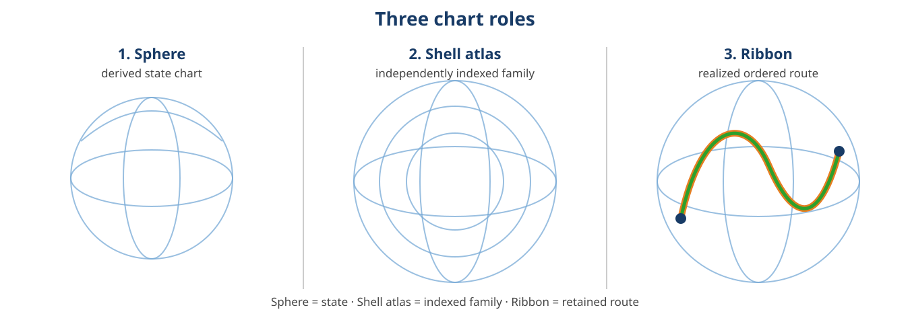

# 10. Derived and independent axis lifts

Let $W$ be a set of underlying alternatives, let

$$\tau:W\rightarrow T$$

be a declared state trace, and write

$$K(f)=\{(u,v)\in W^2:f(u)=f(v)\}$$

for the kernel relation of a map $f$.

The phrase **adding an axis** hides two different operations.

## 10.1 Derived-axis lift

Let $h:T\rightarrow A$ be any deterministic function of the existing trace and define

$$D_h(w)=\bigl(\tau(w),h(\tau(w))\bigr).$$

### Theorem 10.1 - Derived-axis invariance

$$K(D_h)=K(\tau).$$

### Proof

If $D_h(u)=D_h(v)$, equality of first coordinates gives $\tau(u)=\tau(v)$. Conversely, if $\tau(u)=\tau(v)$, applying $h$ gives $h(\tau(u))=h(\tau(v))$, so both coordinates agree. Thus the lift changes representation without adding a distinction. ∎

## 10.2 Independent-axis lift

Let $\lambda:W\rightarrow\Lambda$ be a separately retained observable, condition, label, or provenance coordinate and define

$$J_{\lambda}(w)=\bigl(\tau(w),\lambda(w)\bigr).$$

### Theorem 10.2 - Joint-fiber intersection

$$K(J_{\lambda})=K(\tau)\cap K(\lambda).$$

### Proof

Two ordered pairs are equal exactly when both of their coordinates are equal. ∎

### Corollary 10.3 - Strict refinement witness

If there exist $u,v\in W$ such that

$$\tau(u)=\tau(v)\qquad\text{and}\qquad\lambda(u)\neq\lambda(v),$$

then $J_{\lambda}$ strictly refines $\tau$.

This is the exact distinction behind the three-chart taxonomy: a third coordinate computed from the old chart is a redraw; a separately retained coordinate can change what the interface can distinguish. The joint-fiber identity is established common-refinement mathematics and is also the exact fixed-interface substrate used in *Abstract Loops* and *Compactification Costs*.

{width=6.9in}

## 10.3 The prime-shell dependence boundary

For an exact Eisenstein coordinate $x=(a,b)$, the shell level

$$n=N(x)=a^2+ab+b^2$$

is already determined by $x$. Therefore

$$x\longmapsto\bigl(x,N(x)\bigr)$$

is a derived-axis lift. Plotting $N(x)$ or $\log N(x)$ vertically may reveal nested shells, but it adds no information to the exact coordinate.

The answer changes after a coarsening. If the active trace retains only phase, normalized direction, a sixfold sector, a rounded cell, or another quotient that forgets scale, the shell label may no longer factor through that trace. Adjoining a certified prime address can then be an independent-axis refinement relative to that declared interface.

Thus **derived** and **independent** are not visual properties of an axis. They are relations between the new coordinate and the interface already in force.

> **AUTHOR GEOMETRY INSERT 6 - THE AXIS THAT ADDS NOTHING AND THE AXIS THAT OPENS A FIBER**  
> Use one object drawn twice to show a derived coordinate, then split one old collision with a genuinely separate condition. The visual should make the sentence readable before the notation: new dimension does not automatically mean new information.

# 11. The framed prime-shell atlas

A represented rational prime shell is supplied data

$$s=(p,a,b;\ p\text{ prime},\ a^2+ab+b^2=p).$$

The representation is not produced by the atlas. It enters with its own arithmetic witness. For each supplied $s$, let $\mathcal F(s)$ be the finite set of unit choices whose selected conjugate pair is frame-ready and carries the recorded quality certificates. Version 0.1 proves that $\mathcal F(s)$ is nonempty for every represented rational prime.

## Definition 11.1 - Framed prime-shell atlas

The exact atlas is the indexed sum

$$\mathfrak A_{\mathrm{FPS}}=\sum_{s\in\mathcal R_{\mathrm{prime}}}\mathcal F(s),$$

where $\mathcal R_{\mathrm{prime}}$ is the set of supplied represented prime shells.

An atlas entry retains at least

$$A=(p,a,b,k;\ F_k,\operatorname{Ready},\mathcal A^2\ge3/4,\kappa_2^2\le3).$$

The index and frame are not interchangeable. The prime label says which arithmetic shell is being addressed. The selected conjugate pair says how that shell is locally framed. The certificates say how far the chosen pair is from collapse.

### Theorem 11.2 - Atlas occupancy for represented primes

Every supplied represented rational prime shell has at least one entry in $\mathfrak A_{\mathrm{FPS}}$.

### Proof

Apply Corollary 9.1 to the supplied exact norm representation. It returns a unit choice with readiness, squared normalized area at least $3/4$, and squared condition number at most $3$. Package those fields with the represented prime shell. ∎

The exact atlas is a dependent family, not a picture. A nested-shell drawing is one realization. If a positive radius rule $R(p)$ is declared, one may render each indexed state on a sphere or circle of radius $R(p)$. The radius is then a display coordinate whose information role depends on the starting interface established in Section 10.

The ramified prime $3$ remains an exceptional stratum. It belongs in the same atlas because it carries a valid represented shell and certified frame; it is not silently forced into the same twelve-point orbit type as split primes.

```{=openxml}
<w:p><w:r><w:br w:type="page"/></w:r></w:p>
```

# 12. Trace-bearing prime-shell ribbons

The atlas records the available indexed states. A ribbon records an ordered realized route through them.

## Definition 12.1 - Prime-shell ribbon

A finite prime-shell ribbon is a nonempty ordered sequence

$$\rho=(A_0,A_1,\ldots,A_m),\qquad A_j\in\mathfrak A_{\mathrm{FPS}}.$$

Its exact route data include the vertex list, first entry, last entry, and edge count $m$. The endpoint projection

$$\operatorname{end}(\rho)=A_m$$

forgets every earlier vertex. A rendered smooth strip may aid inspection, but the arithmetic ribbon is the discrete ordered record and its integrity trace.

## Proposition 12.2 - Endpoint-route separation

Two prime-shell ribbons can have the same first and last entries while remaining different routes.

### Fixture

Use certified ready frames on the represented shells $3$, $7$, and $13$. Compare

$$\rho_{\mathrm{direct}}=(3,13)$$

with

$$\rho_{\mathrm{via}}=(3,7,13).$$

They share their first and last framed shells, but their edge counts are $1$ and $2$. Hence they are not the same ordered ribbon.

{width=6.25in}

## 12.1 Transport along a ribbon

Let $x_j$ be the selected ready frame carried by $A_j$. Define the composite transport

$$T_{\rho}=T_{x_{m-1}\rightarrow x_m}\circ\cdots\circ T_{x_0\rightarrow x_1},$$

with the singleton ribbon assigned the identity map.

### Theorem 12.3 - Flat finite ribbon transport

For every finite ready ribbon,

$$T_{\rho}=T_{x_0\rightarrow x_m}.$$

### Proof

Induct on the number of appended vertices. The singleton case is $T_{x\rightarrow x}=\operatorname{id}$. For the induction step, assume the transport through $x_j$ equals $T_{x_0\rightarrow x_j}$. Then the v0.1 composition law gives

$$T_{x_j\rightarrow x_{j+1}}\circ T_{x_0\rightarrow x_j}=T_{x_0\rightarrow x_{j+1}}.$$

Thus every finite composite reduces to the direct endpoint transport. ∎

### Corollary 12.4 - Same endpoint map, different retained history

The direct and via-$7$ fixture ribbons induce the same transport map even though their ordered routes differ.

This is not a defect. It identifies exactly where the history lives. The v0.1 transport is flat and endpoint-determined; the ribbon is the separate carrier of path information. Nontrivial twist, holonomy, accumulated cost, uncertainty, or route-dependent action would require an additional path-sensitive structure and remains outside the present theorem.

This separation matches the role discipline already used in GPPR and GOLD: a commutative endpoint may agree while an ordered factor-event or occurrence/receipt route remains different. Those papers are same-lineage neighbors, not independent corroboration.

> **AUTHOR GEOMETRY INSERT 7 - THE ATLAS IS THE ROOM; THE RIBBON IS WHAT HAPPENED**  
> Show the atlas as available indexed framed states and the ribbon as one ordered route through them. Put two different ribbons beside one shared endpoint. Make the flatness result visible: endpoint transport closes while route history stays in the ribbon.

```{=openxml}
<w:p><w:r><w:br w:type="page"/></w:r></w:p>
```

# 13. Three Smith charts: external engineering realization

The Smith chart makes the derived-axis, atlas, and ribbon distinction unusually concrete. Let

$$z=\frac{Z_L}{Z_0}$$

be normalized load impedance and

$$\Gamma=\frac{z-1}{z+1}$$

its reflection coefficient. The ordinary Smith chart is a Möbius-coordinate diagram in the complex $\Gamma$ plane.

## 13.1 Chart one: spherical state

Write $\Gamma=u+iv$. The stereographic lift used by spherical Smith-chart constructions is

$$\sigma(\Gamma)=\left(\frac{2u}{1+u^2+v^2},\frac{2v}{1+u^2+v^2},\frac{1-u^2-v^2}{1+u^2+v^2}\right).$$

Direct algebra gives

$$\|\sigma(\Gamma)\|^2=1,$$

and the planar point is recovered on the image by

$$\Gamma=\frac{X+iY}{1+Z}.$$

The sphere therefore carries the same two degrees of freedom as the plane. Its third coordinate is derived. It is a state chart, not an information gain.

## 13.2 Chart two: shell-indexed family

Now retain a genuinely separate condition

$$\lambda\in\Lambda,$$

such as frequency, time, temperature, bias, power, measurement epoch, or network-construction stage. The exact family carrier is

$$S^2\times\Lambda.$$

A radial visualization may choose a positive radius function $R:\Lambda\rightarrow\mathbb R_{>0}$ and draw

$$\Phi(\Gamma,\lambda)=R(\lambda)\sigma(\Gamma).$$

Then

$$\|\Phi(\Gamma,\lambda)\|^2=R(\lambda)^2.$$

Every fixed condition occupies one spherical shell. The exact information account remains the product pair unless faithfulness of the chosen radial encoding is separately established.

## 13.3 Chart three: realized ribbon

A particular sweep or experiment occupies only an ordered subset of the atlas:

$$\mathcal R=\{(\sigma(\Gamma(\lambda)),\lambda):\lambda\in I\}\subseteq S^2\times\Lambda.$$

For sampled data, $\mathcal R$ is an ordered sequence. With interpolation and a separately declared transverse width, it may be rendered as a ribbon or tube. Repeated visits to the same Smith state can remain distinct because the independent condition and order are retained.

{width=7.0in}

The compact reading is:

> **The sphere is where the state is. The shells are where states are indexed under each condition. The ribbon is the route actually retained through them.**

Existing literature already supplies the ordinary Smith chart, spherical Smith charts on the Riemann sphere, and 3D multi-parameter uses involving frequency orientation, variable homothety, quality factor, temperature, and active or passive regions. Version 0.2 does not claim to invent any of those constructions. Their role here is to expose the general information distinction and return it to the framed prime-shell setting:

$$\text{framed shell}\quad\longrightarrow\quad\text{shell atlas}\quad\longrightarrow\quad\text{trace-bearing ribbon}.$$

The informal phrase **Golden Rainbow Prime Shell Ribbons** names the visual synthesis only. Prime structure supplies an exact arithmetic address, golden or other color/angle schedules may supply declared display orientation, shells supply the indexed family, and ribbons supply ordered trace. None of those display choices becomes arithmetic authority merely because the image is compelling.

```{=openxml}
<w:p><w:r><w:br w:type="page"/></w:r></w:p>
```
